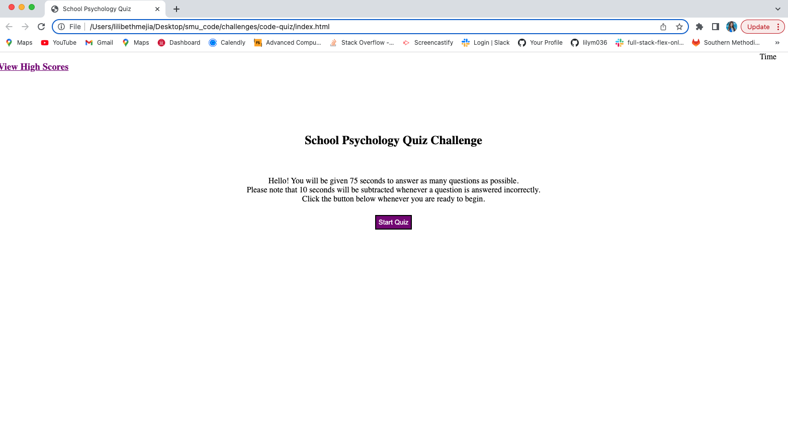

# code-quiz

## Description
This project is a timed quiz that assesses an individual's knowledge on school psychology fundamentals. It stores high scores so that a person can gauge their personal progress compared to their peers. 

## Installation
N/A

## Usage
Open index.html file in the browser. Click on the "Start Quiz" button when you are ready to begin. A timer will begin counting down when the start button is pressed. Choose an answer for each question presented. An incorrect answer subtracts 10 seconds from the clock. You will be directed to the next question when choosing the correct answer. When finished with the quiz, input your initials in the text box and click the "submit" button to save your initials and score. 

;

https://lilym036.github.io/code-quiz/

## Credits
Matthew Calimbas- Tutor; Fred Kamm- TA

## License
MIT License

Copyright (c) 2023 Lilibeth Mejia

Permission is hereby granted, free of charge, to any person obtaining a copy of this software and associated documentation files (the "Software"), to deal in the Software without restriction, including without limitation the rights to use, copy, modify, merge, publish, distribute, sublicense, and/or sell copies of the Software, and to permit persons to whom the Software is furnished to do so, subject to the following conditions:

The above copyright notice and this permission notice shall be included in all copies or substantial portions of the Software.

THE SOFTWARE IS PROVIDED "AS IS", WITHOUT WARRANTY OF ANY KIND, EXPRESS OR IMPLIED, INCLUDING BUT NOT LIMITED TO THE WARRANTIES OF MERCHANTABILITY, FITNESS FOR A PARTICULAR PURPOSE AND NONINFRINGEMENT. IN NO EVENT SHALL THE AUTHORS OR COPYRIGHT HOLDERS BE LIABLE FOR ANY CLAIM, DAMAGES OR OTHER LIABILITY, WHETHER IN AN ACTION OF CONTRACT, TORT OR OTHERWISE, ARISING FROM, OUT OF OR IN CONNECTION WITH THE SOFTWARE OR THE USE OR OTHER DEALINGS IN THE SOFTWARE.

